## flex와 grid의 차이  
flex는 1줄, grid는 여러줄의 레이아웃을 설정하는데 편리하다.  

## flex container  
[참고 사이트 →](https://studiomeal.com/archives/197)  

컨테이너에 플랙스 속성을 지정하면 아이템들이 설정에 따라 정렬된다.  
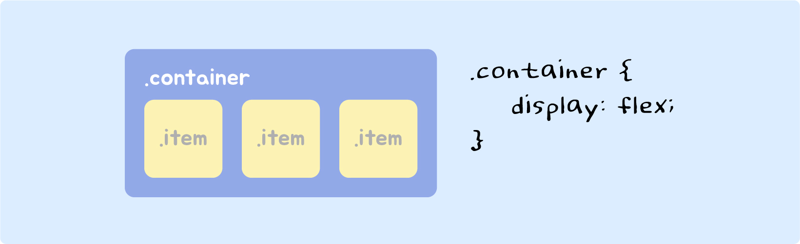{: width="100%"}  

### flex-direction 배치 방향 설정  
- **row(기본값)**: 수평 방향으로 배치, 왼쪽에서 오른쪽
- **row-reverse**: 수평 방향으로 배치, 오른쪽에서 왼쪽(역순)
- **column**: 수직 방향으로 배치, 위쪽에서 아래쪽
- **column-reverse**: 수직 방향으로 배치, 아래쪽에서 위쪽(역순)  

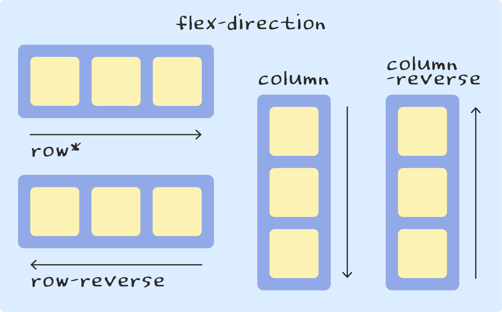{: width="100%"}  

### flex-wrap 줄넘김 처리 설정  
: 아이템이 컨테이너를 넘을 때 처리 방식 속성  
- **nowrap(기본값)**: 줄바꿈 하지 않음
- **wrap**: 줄바꿈 적용
- **wrap-reverse**: 줄바꿈 적용, 역순 배치  

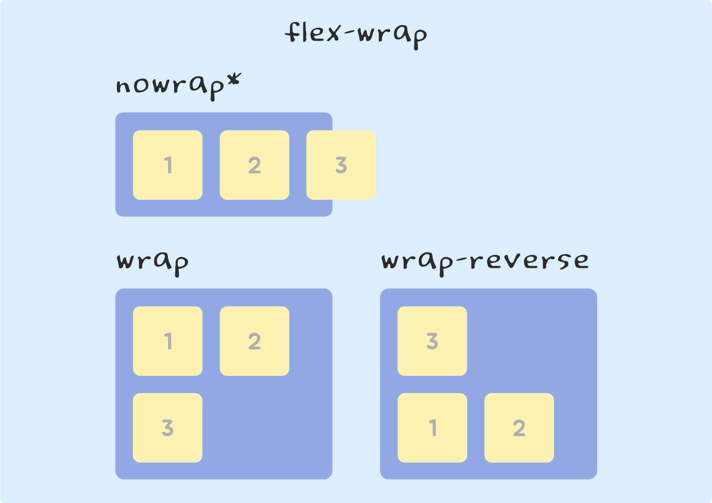{: width="100%"}  

### flex-flow  
: flex-direction과 flex-wrap을 한번에 지정할 수 있는 속성  
  direction (한 칸 띄고) wrap 순서로 작성.  

### justify-content 메인축 방향 정렬  
- **flex-start(기본값)**: 아이템들을 시작점으로 정렬, row일 때 왼쪽, column일 때 위쪽
- **flex-end**: 아이템들을 끝점으로 정렬, row일 때 오른쪽, column일 때 아래쪽
- **center**: 아이템들을 가운데로 정렬
- **space-between**: 아이템들의 사이사이에 일정한 간격 생성
- **space-around**: 아이템들의 둘레에 일정한 간격 생성
- **space-evenly**: 아이템들의 사이와 양 끝에 일정한 간격 생성 (! IE와 엣지에서는 지원 안됨)  

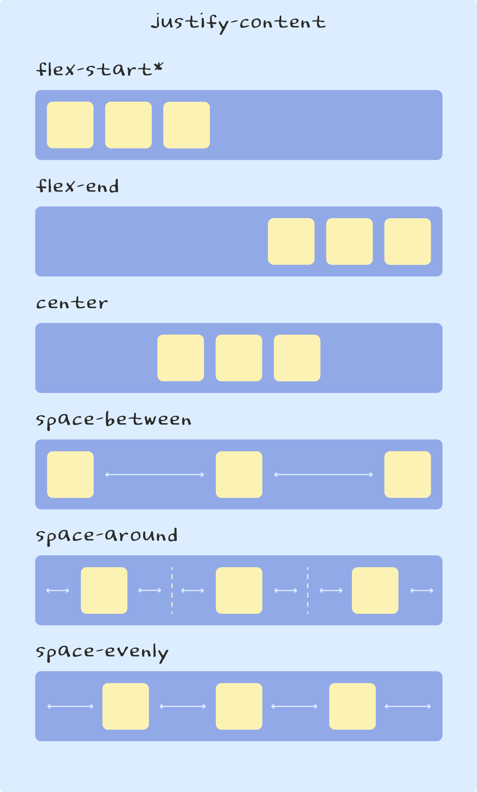{: width="100%"}  

### align-items 수직축 방향 정렬  
- **stretch(기본값)**: 아이템들이 수직축 방향으로 늘어남
- **flex-start**: 아이템들을 시작점으로 정렬, row일 때 왼쪽, column일 때 위쪽
- **flex-end**: 아이템들을 끝점으로 정렬, row일 때 오른쪽, column일 때 아래쪽
- **center**: 아이템들을 가운데로 정렬
- **baseline**: 아이템들을 텍스트 베이스라인을 기준으로 정렬  

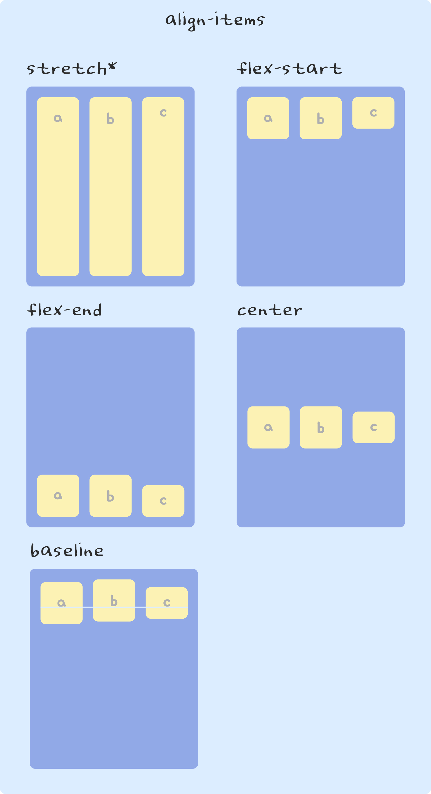{: width="100%"}  

#### flex 속성으로 가운데 정렬  
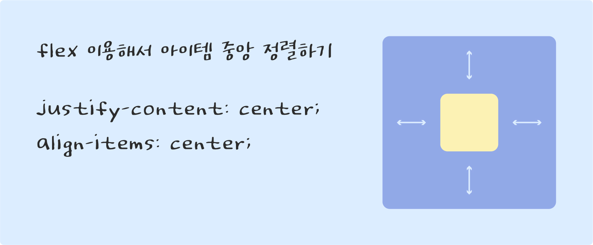{: width="100%"}  

### align-content 여러 행 정렬  
: 아이템이 2줄 이상일 경우 수직축 방향 정렬을 결정하는 속성  
  justify-content와 비슷하다.  

- **flex-start(기본값)**: 아이템들을 시작점으로 정렬, row일 때 왼쪽, column일 때 위쪽
- **flex-end**: 아이템들을 끝점으로 정렬, row일 때 오른쪽, column일 때 아래쪽
- **center**: 아이템들을 가운데로 정렬
- **space-between**: 아이템들의 사이사이에 일정한 간격 생성
- **space-around**: 아이템들의 둘레에 일정한 간격 생성
- **space-evenly**: 아이템들의 사이와 양 끝에 일정한 간격 생성 (! IE와 엣지에서는 지원 안됨) 

## flex item  


### flex-basis 유연한 박스의 기본 영역  
: 플랙스 아이템의 기본 크기 지정  
  (row에서 너비, column에서 높이)  
- 값으로 width, height에 사용하는 단위들이 쓰임
- **auto(기본값)**: 해당 아이템의 width 값 (따로 지정되지 않을 경우 컨텐츠의 크기)
- **content**: 컨텐츠의 크기값 (width를 따로 설정하지 않은 경우와 같음)  

#### flex-basis와 width  
- **flex-basis가 80px인 경우**: 원래의 너비가 80px을 넘지 않는 아이템은 80px로 늘어나고, 원래 80px을 넘는 아이템은 그대로 유지
- **width가 80px인 경우**: 원래 80px을 넘던 아이템도 80px에 맞춰 줄어든다. (! 여기선 {word-wrap: break-word;} 적용된 상태)  

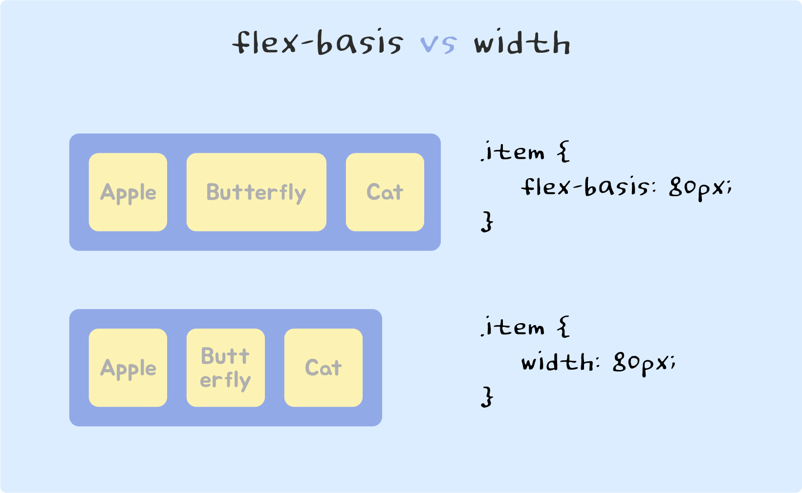{: width="100%"}  

### flex-grow 유연하게 늘리기  
: 아이템이 flex-basis보다 커질 수 있는지 결정하는 속성  
- **0(기본값)**: 늘어나지 않음
- **0보다 큰 수**: 원래 크기보다 커지면서 빈 공간을 채움  

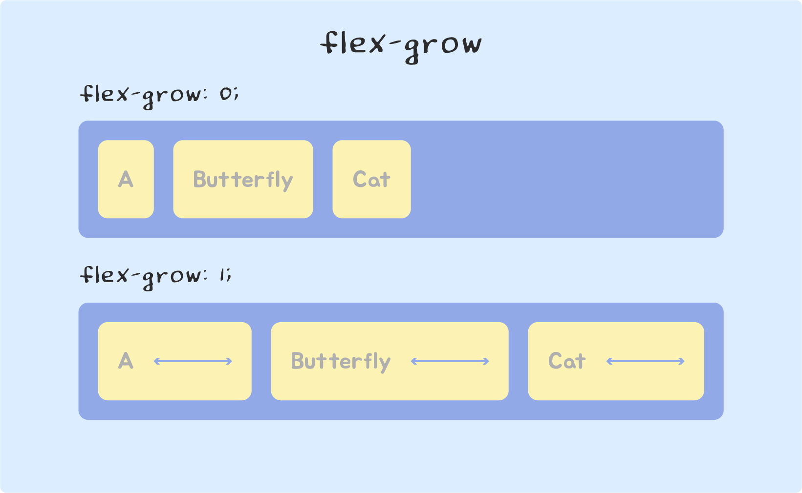{: width="100%"} 
  
여기서 속성값(숫자)의 의미는 각 아이템마다 flex-basis를 제외한 **여백부분**을 flex-grow에 **지정된 숫자의 비율로** 나눠 가진다는 뜻  

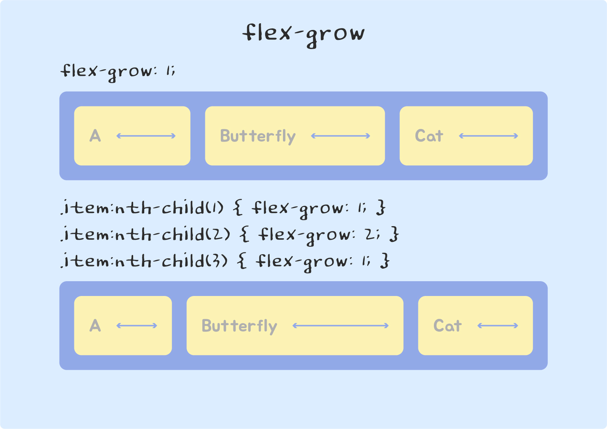{: width="100%"}  

### flex-shrink 유연하게 줄이기  
: 아이템이 flex-basis보다 작아질 수 있는지 결정하는 속성  
- flex-grow처럼 0보다 큰 값이면 줄어들 수 있는 박스가 되는데, 차이점은 **1이 기본값**이다.  

### flex  
: flex-grow, flex-shrink, flex-basis를 한 번에 지정할 수 있는 속성  
- `flex: 1;`: flex-grox: 1; flex-shrink: 1; flex-basis: 0%;
- `flex: 1 1 auto;`: flex-grox: 1; flex-shrink: 1; flex-basis: auto;
- `flex: 1 500px;`: flex-grox: 1; flex-shrink: 1; flex-basis: 500px;
- ! 주의할 점은 `flex: 1;`처럼 flex-basis 부분을 생략하면 flex-basis의 값은 0이 됨  

### align-self 수직축으로 아이템 정렬  
: align-items가 전체 아이템의 수직축 정렬이라면 이건 **해당 아이템의 수직축 정렬**  
  또, align-slef가 align-items보다 우선권이 있다.
- **auto(기본값)**: align-items 설정을 상속받음
- **stretch**: 아이템들이 수직축 방향으로 늘어남
- **flex-start**: 아이템들을 시작점으로 정렬, row일 때 왼쪽, column일 때 위쪽
- **flex-end**: 아이템들을 끝점으로 정렬, row일 때 오른쪽, column일 때 아래쪽
- **center**: 아이템들을 가운데로 정렬
- **baseline**: 아이템들을 텍스트 베이스라인을 기준으로 정렬  

### order 배치 순서  
: 각 아이템의 시각적 나열 순서를 지정하는 속성  
- 숫자값이 들어가며 숫자가 작을 수록 앞에 배치된다.
- 단, html 자체의 구조가 아닌 시각적 나열의 순서를 바꾸는 것이기 떄문에 시각장애인의 접근성은 좋지 않다.  

### z-index  
: position의 z-index와 같음.  


## grid 형태  
[참고 사이트 →](https://studiomeal.com/archives/533)   

{: width="100%"}

### 그리드 형태 정의  
- **grid-templete-colums**: 열(column, 수평) 배치 결정
- **grid-templete-rows**: 행(row, 수직) 배치 결정  

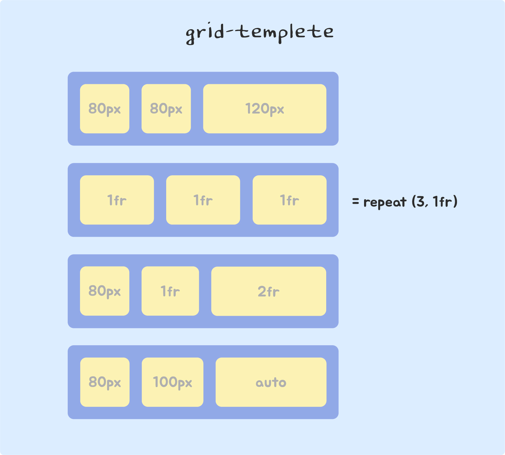{: width="100%"}  

#### repeat 함수  
: `repeat(반복횟수, 반복값)`  
: 반복값(길이)을 반복횟수만큼 자동으로 생성해준다.  

#### minmax 함수  
: `minmax(최소값, 최대값)`  
: 길이가 최소값보다 작아지지 않고 최대값보다 커지지 않게 한다.  

#### auto-fill과 auto-fit  
: column의 개수를 미리 정하지 않고 설정된 너비가 허용되는만큼 최대한 셀을 채운다.  

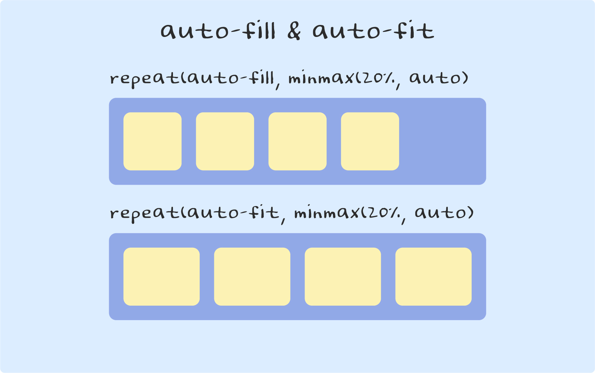{: width="100%"}  
- auto-fill의 크기를 20%로 지정해서 셀이 5개의 셀이 들어가게 된다.
    - 하지만 셀의 개수가 5개보다 모자란 4개일 경우 한 칸의 공간이 남는다.
- auto-fit은 남는 공간이 없도록 셀의 크기를 늘린다.

### 간격 만들기  
: 셀과 셀 사이의 간격을 지정할 수 있는 속성  
- row-gap
- column-gap
- gap

### 그리드 형태를 자동으로 정의  
- grid-auto-columns
- grid-auto-rows

### 각 셀의 영역 지정  
- **grid-column-start**: 셀이 시작하는 열의 그리드 라인 번호
- **grid-column-end**: 셀이 끝나는 열의 그리드 라인 번호
- **grid-column**: 시작과 끝의 열 번호를 한 번에 지정 `grid-column-start / grid-column-end`
- **grid-row-start**: 셀이 시작하는 행의 그리드 라인 번호
- **grid-row-end**: 셀이 끝나는 행의 그리드 라인 번호
- **grid-row**: 시작과 끝의 행 번호를 한 번에 지정 `grid-row-start / grid-row-end`  

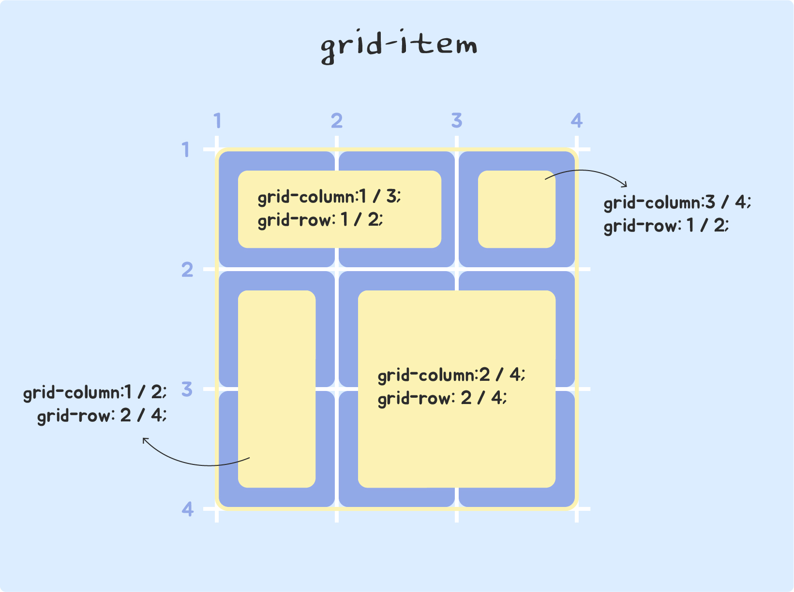{: width="100%"}  

- 영역을 지정할 때, `시작하는 라인 번호 / span 차지하는 칸의 개수`로 작성할 수 있다.
    - `1 / 3` = `1 / span 2`  


### 영역 이름으로 그리드 정의  
: grid-templete-areas  
```css
.container {
    grid-templete-areas:
        "header header header"
        "  a     main    b   "
        "  .      .      .   "
        "footer footer footer"
}
```  
각 셀마다 공백을 하나씩 넣어서 구분  

```css
.header {
    grid-area: header;
}
.sidebar-a {
    grid-area: a;
}
.main-content {
    grid-area: main;
}
.sidebar-b {
    grid-area: b;
}
.footer {
    grid-area: footer;
}
```  
해당 아이템에 grid-area 속성으로 이름 지정  

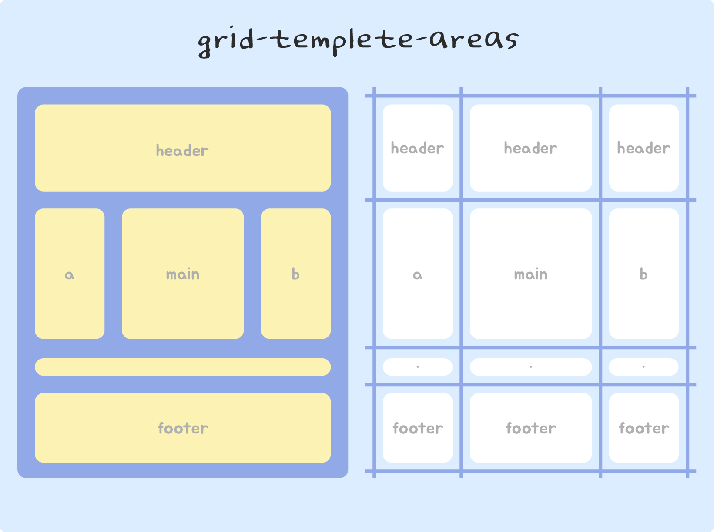{: width="100%"}  


### 자동 배치  
: grid-auto-flow  
: 아이템이 자동으로 배치되는 흐름을 결정하는 속성  
- 자세한 내용은 [사이트](https://studiomeal.com/archives/533) 참고하는게 빠름!  

### align-items 세로 방향 정렬  

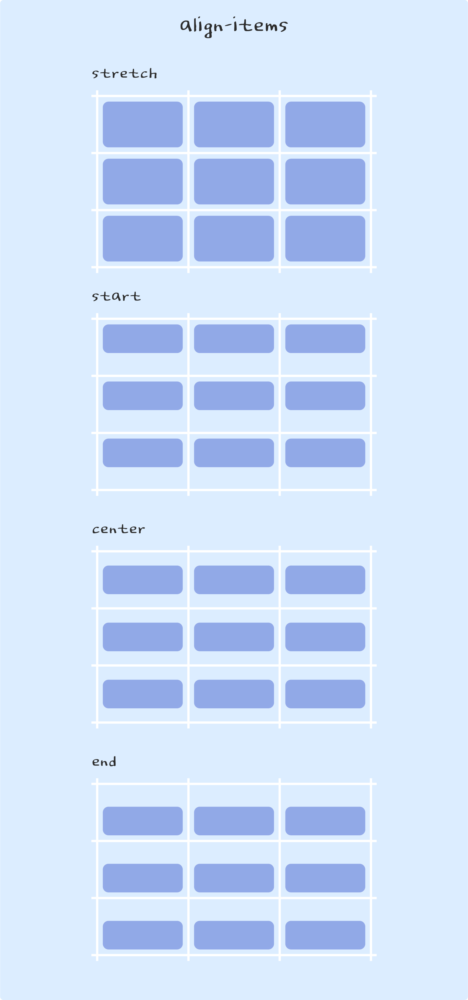{: width="100%"}  

### justify-items 가로 방향 정렬  

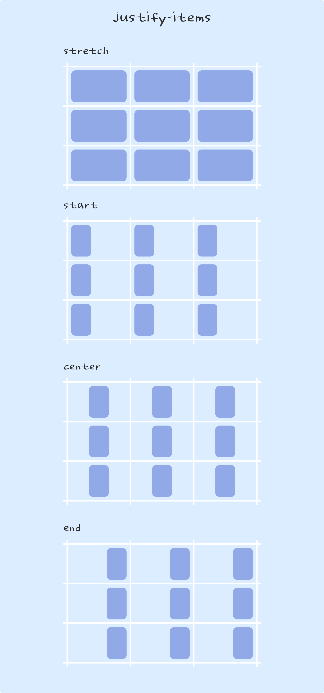{: width="100%"}  

### place-items  
: align-items와 justify-items를 한 번에 설정할 수 있는 속성  
: align-items justify-items 순서로 작성하며 하나의 값만 작성 시 두 속성에 동시에 적용된다.


### align-content 아이템 그룹 세로 정렬  

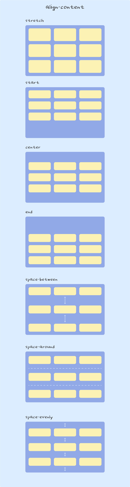{: width="100%"}  

### justify-content 아이템 그룹 가로 정렬  

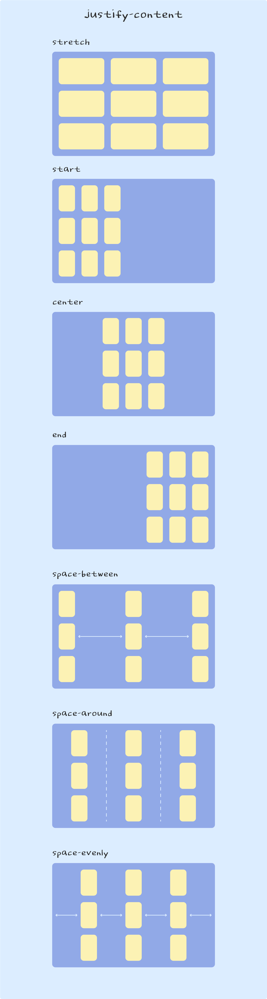{: width="100%"}  

### place-content  
: align-content와 justify-content를 한 번에 설정할 수 있는 속성  
: align-content justify-content 순서로 작성하며 하나의 값만 작성 시 두 속성에 동시에 적용된다.

## grid 정렬  

### align-self 개별 아이템 세로 정렬  
: 해당 아이템을 설정에 따라 세로 정렬하는 속성  

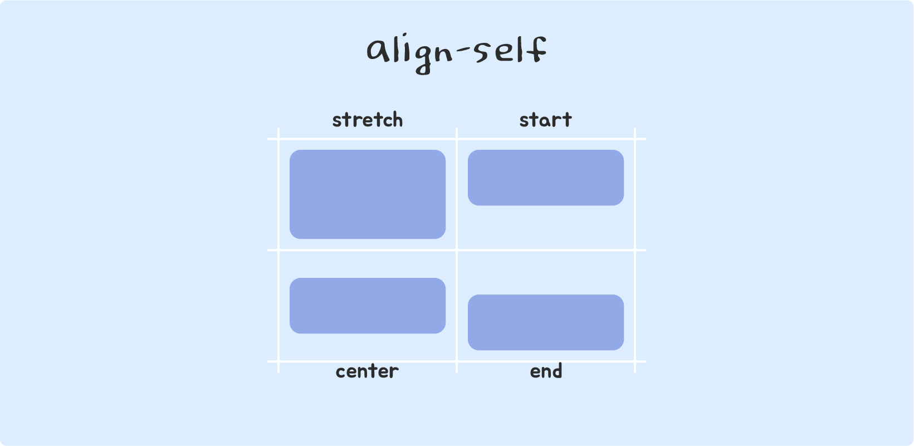{: width="100%"}  

### justify-self 개별 아이템 가로 정렬  
: 해당 아이템을 설정에 따라 가로 정렬하는 속성 

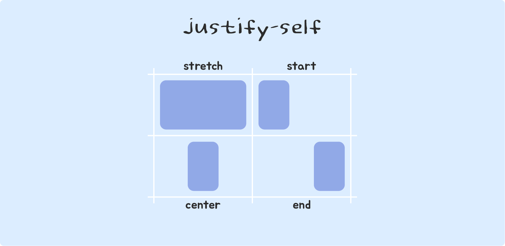{: width="100%"}  

### place-self  
: align-self와 justify-self를 한 번에 설정할 수 있는 속성  
: align-self justify-self 순서로 작성하며 하나의 값만 작성 시 두 속성에 동시에 적용된다.

### order 배치 순서  
: 각 아이템의 시각적 나열 순서를 지정하는 속성  
- 숫자값이 들어가며 숫자가 작을 수록 앞에 배치된다.
- 단, html 자체의 구조가 아닌 시각적 나열의 순서를 바꾸는 것이기 떄문에 시각장애인의 접근성은 좋지 않다.  

### z-index  
: position의 z-index와 같음.  


